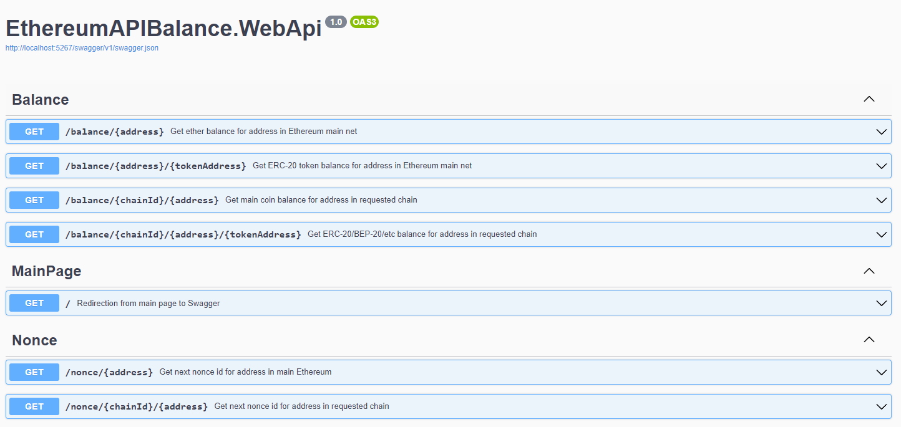
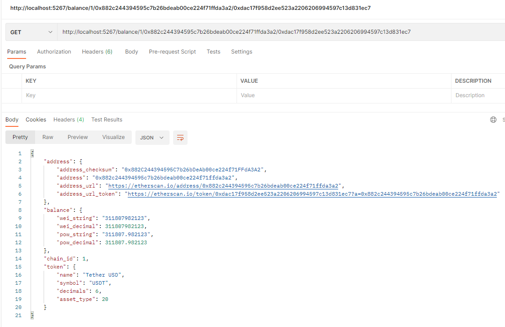

Ethereum API Balance Service
===========
[](https://hub.docker.com/r/nokitakaze/ethereum-api-balance)
[](https://hub.docker.com/r/nokitakaze/ethereum-api-balance)
[](https://hub.docker.com/r/nokitakaze/ethereum-api-balance)

HTTP-service for Ethereum balance receiving

## Using
You could use plain HTTP get requests to obtaining main coin and ERC-20 tokens balance and current nonce id for addresses in Ethereum-like chain (e.g. Ethereum, Goeli, Binance Smart Chain/BNB Smart Chain).

**Swagger included.**





## Docker
```yml
version: "3"
services:
    app:
        image: nokitakaze/ethereum-api-balance
        ports:
            - "5267:5267"
```

Then
```sh
docker-compose up -d
```

## License
Licensed under the Apache License.

This software is provided **"AS IS" WITHOUT WARRANTIES OR CONDITIONS OF ANY KIND, either express or implied**.
